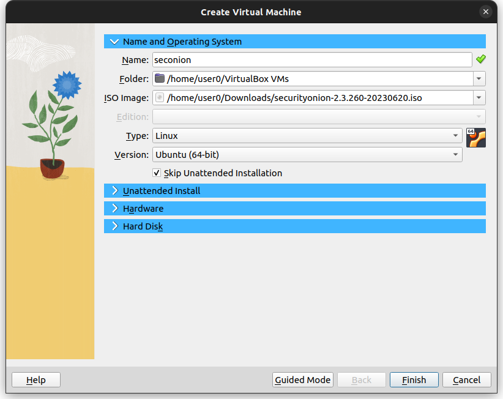
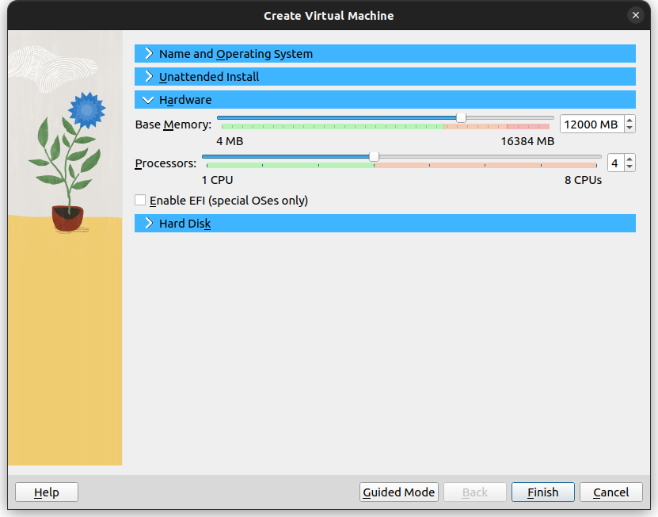
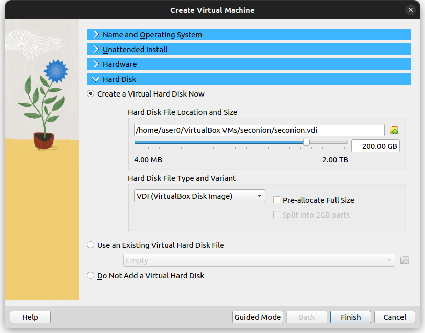
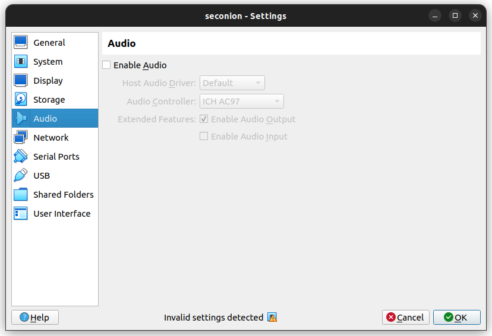
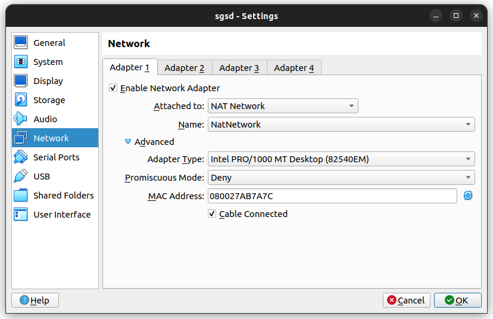
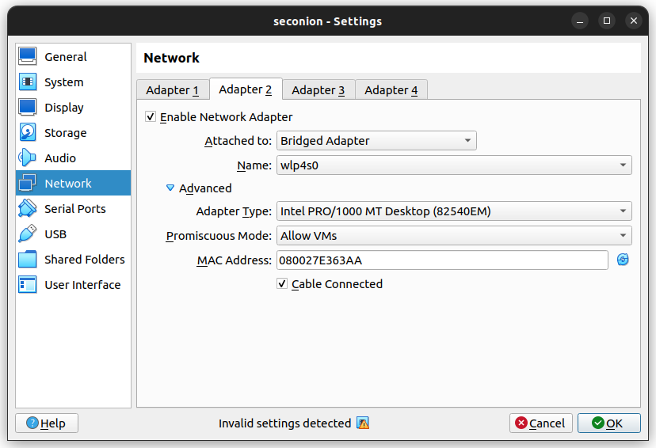
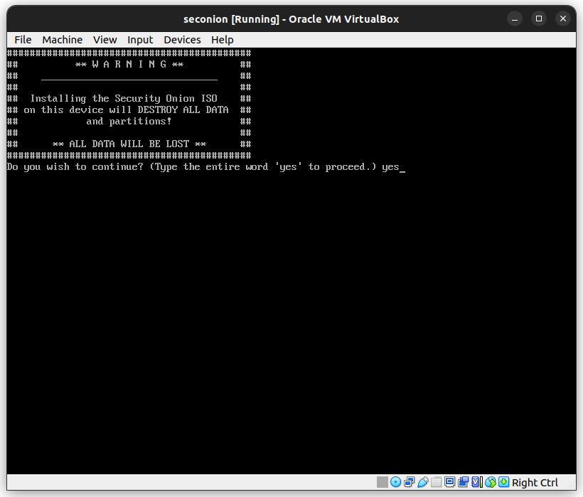
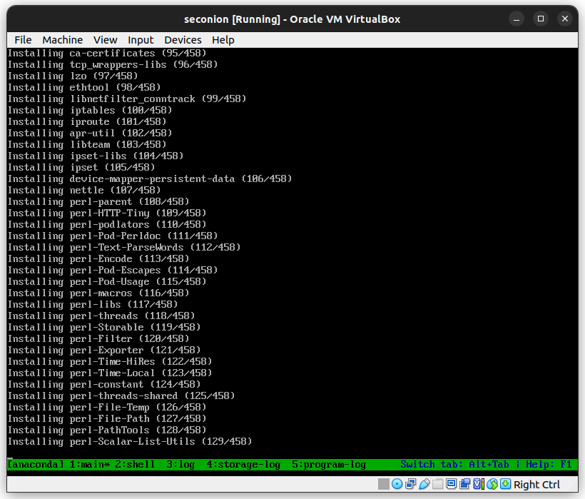

# security-onion-install-tutorial
This is a tutorial on installing a Security Onion instance on a Virtualbox VM, with an Ubuntu VM to access the analyst interface.

### Downloading Security Onion ISO
- Visit the repo and click on the download link: https://github.com/Security-Onion-Solutions/securityonion/blob/master/VERIFY_ISO.md

- Check the SHA256sum hash of the downloaded file. It should match with the one in the repo: `sha256sum securityonion-2.3.260-20230620.iso`
	output: `06ed74278587b09167fbac1e5796b666fc24ad15d06ea3cc36419d07967e06dd  securityonion-2.3.260-20230620.iso`

- Now we launch VirtualBox and start creating the VM instance for Security Onion:

Make sure to select "Ubuntu(64-bit)" version and check "Skip Unatttended Installation".

- For Hardware, we are selecting 12000MB(12GB) and 4 CPU's, which are the minimum requirements that Security Onion recommends. https://docs.securityonion.net/en/2.3/hardware.html#hardware

- For Hard Disk, we are selection 200GB which is the minimum recommended.

- Now we are clicking on settings for the seconion VM. We are disabling audio, which we don't need. For Network, we will have two adapters; the first one will be a Internal Network for the interface & the second one will Bridged Adapter with Promiscuous Mode to "Allow VMs" for monitoring.

This step is optional.

Please note the MAC address so you can select the right Adapter during setup.

Promiscuous mode allows the adapter to collect all the traffic going through the network.

- Now we press "Start" while selecting the seconion VM to start the instance.

- Let the timer run out to start the automatic boot, and type yes in the next screen

- Enter an username: `admin`

- Enter password and re-type.

- Now a bunch of packages will be install so just wait.

